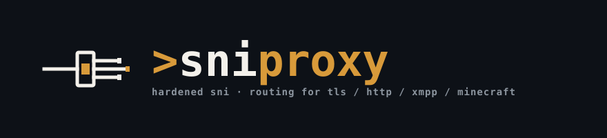

<p align="center">
  
</p>

<h3 align="center">Hardened SNI Proxy</h3>

<p align="center">
  <em>Route HTTP, TLS, DTLS, XMPP and Minecraft connections by hostname, without decrypting traffic.</em>
</p>

<p align="center">
  <a href="https://github.com/renaudallard/sniproxy/releases/latest">
    
  </a>
  <a href="https://github.com/renaudallard/sniproxy/releases">
    
  </a>
  <a href="https://github.com/renaudallard/sniproxy/actions/workflows/build-and-fuzz.yml">
    
  </a>
  <a href="https://github.com/renaudallard/sniproxy/actions/workflows/sanitizers.yml">
    
  </a>
  <a href="https://github.com/renaudallard/sniproxy/actions/workflows/valgrind.yml">
    
  </a>
  <a href="https://github.com/renaudallard/sniproxy/actions/workflows/continuous-fuzzing.yml">
    
  </a>
  <a href="./COPYING">
    
  </a>
  <a href="https://www.paypal.me/RenaudAllard">
    
  </a>
</p>

---

SNIProxy inspects the **first packet** of an inbound connection, extracts the
client-requested hostname (SNI for TLS/DTLS, `Host` for HTTP, `:authority` for
HTTP/2, the stream `to` attribute for XMPP, the handshake server address for
Minecraft), and forwards the connection to a backend selected by hostname
pattern. The encrypted payload is **never decrypted**, so no private key
material is ever installed on the proxy host. This makes name-based virtual
hosting work for HTTPS the same way it does for HTTP.

The fork is a hardened, production-oriented continuation of the original
sniproxy by Dustin Lundquist, with privilege separation, encrypted IPC,
per-platform sandboxing (pledge/unveil, Capsicum, seccomp), continuous
fuzzing, and active maintenance.

> Primary platform: **OpenBSD**. Best-effort support on Linux, FreeBSD and macOS.

## Highlights

- **Name-based proxying without decryption**: TLS/DTLS SNI, HTTP/1 Host,
  HTTP/2 HPACK `:authority`, XMPP stream `to`, Minecraft handshake. No
  certificates or private keys on the proxy.
- **Five protocols, one binary**: TLS, DTLS (UDP), HTTP/1 + HTTP/2, XMPP
  (with STARTTLS), Minecraft Java Edition (FML and BungeeCord markers
  stripped automatically).
- **Pattern matching**: exact hostnames or PCRE2 (JIT-compiled where
  available), per-table backend selection with optional client-IP affinity.
- **Wildcard backends**: route to the dynamically resolved hostname the
  client asked for (`*:443`).
- **HAProxy PROXY protocol**: emit v1 or v2 headers to backends; accept v1
  or v2 from upstream load balancers (auto-detected).
- **Privilege separation**: four cooperating processes:
  `sniproxy-mainloop`, `sniproxy-binder`, `sniproxy-logger`,
  `sniproxy-resolver`. All IPC is encrypted with ChaCha20-Poly1305.
- **Per-platform sandboxing**: pledge(2) + unveil(2) on OpenBSD, Capsicum
  capability mode on FreeBSD, seccomp BPF on Linux.
- **DTLS source validation**: a new UDP session is held until a
  retransmission arrives from the same source address and port before any
  backend traffic is sent, so spoofed sources cannot turn the proxy into a
  reflection amplifier.
- **Per-IP rate limiting**: FNV-1a hashed, arc4random-seeded token
  buckets cap new TCP connections and UDP sessions; short-chain cutoffs
  defeat hash spraying.
- **Backend ACLs**: `deny_except` or `allow_except` CIDR policies stop
  abuse as an open proxy to reach internal hosts.
- **Listener ACLs**: the same CIDR policies, applied to inbound clients.
- **DNS-over-TLS upstreams**: `nameserver dot://9.9.9.9/dns.quad9.net/tls1.2`
  inside the `resolver` block; IP literals require a TLS hostname or an
  explicit `/insecure`. TLS 1.2 is enforced by default.
- **Hot reload**: SIGHUP re-reads the config, re-resolves backends and
  rebuilds tables without dropping live connections. Reference counting
  keeps old tables alive while connections that pinned them drain.
- **Zero-copy on OpenBSD**: SO_SPLICE moves data in the kernel after the
  handshake is parsed, user buffers shrink to 4 KiB and the idle timer
  checks the kernel byte counters, so one silent direction does not end
  a live connection.
- **Bounded memory**: per-connection buffer caps, a global soft limit
  that aggressively trims idle buffers, and a 4096-entry shrink queue stop
  slow clients from pinning unbounded RAM.
- **Continuous fuzzing**: dedicated harnesses for TLS, DTLS, HTTP/2,
  XMPP, Minecraft, hostname, address, config, listener ACL, IPC crypto and
  resolver responses run in CI and on a separate continuous-fuzzing job.

## Protocol support

| Protocol | Hostname source | Notes |
| --- | --- | --- |
| TLS 1.0&ndash;1.3 | SNI extension in ClientHello | TLS 1.2+ enforced by default; `-T 1.0/1.1/1.2/1.3` overrides |
| DTLS | SNI extension in UDP ClientHello | Source-address validation by waiting for a retransmission |
| HTTP/1.x | `Host:` request header | Per-listener `bad_requests log` records malformed input |
| HTTP/2 | HPACK `:authority` pseudo-header | Bounded HPACK table (per-conn 64 KiB / global 4 MiB) |
| XMPP | `to` attribute on `<stream:stream>` | STARTTLS negotiation passes through untouched |
| Minecraft (Java Edition) | Server address in handshake packet | FML and BungeeCord NUL-delimited trailers stripped |

## Architecture

SNIProxy runs as four cooperating processes:

1. **`sniproxy-mainloop`**: accepts connections, parses the first protocol
   header, picks a backend and forwards bidirectionally.
2. **`sniproxy-binder`**: the only process that keeps the privilege to
   `bind()` low ports. It hands listening sockets back to the main loop on
   startup and on every SIGHUP reload, then idles. Allowlisted to the
   listener addresses present in the config; root-bound Unix-socket
   listeners are confined to `/run` or `/var/run`.
3. **`sniproxy-logger`**: owns the log files. The main loop sends log
   lines over an encrypted Unix socket, so a compromised main loop cannot
   forge or replay log writes.
4. **`sniproxy-resolver`**: runs c-ares for async DNS, with arc4random
   query IDs, mutex-guarded restart state, and per-client concurrency caps.

All IPC channels are encrypted with ChaCha20-Poly1305 keys derived once in
the parent and inherited across `fork()`, so children never have to read
key material from disk or call `mlock()` after `pledge()`. Each helper
process drops privileges immediately and, on a platform that provides one
(pledge/unveil, Capsicum, or seccomp), enters its sandbox before reading
any tainted input.

See [ARCHITECTURE.md](ARCHITECTURE.md) for the full design and process
boundaries, and [SANITIZERS.md](SANITIZERS.md) for how to build under
ASan/MSan/UBSan/TSan.

## Quick start

```nginx
user daemon
group daemon

pidfile /var/run/sniproxy.pid

error_log {
    filename /var/log/sniproxy/error.log
    priority notice
}

listener 0.0.0.0:443 {
    protocol tls
    table https_hosts

    # Used when the ClientHello has no usable SNI
    fallback 192.0.2.50:443

    access_log {
        filename /var/log/sniproxy/access.log
    }
}

table https_hosts {
    # Exact host. Bare hostnames are auto-anchored, so this matches
    # "example.com" only, never "sub.example.com".
    example.com         192.0.2.10:443

    # PCRE2 regular expression
    .*\.example\.net    192.0.2.11:443

    # Wildcard backend: connect to whatever the client asked for
    .*\.cdn\.example    *:443
}
```

Validate with `sniproxy -t -c /etc/sniproxy.conf`, then start in
foreground with `sniproxy -f -c /etc/sniproxy.conf`.

## Usage

```
Usage: sniproxy [-c <config>] [-f] [-g] [-t] [-n <max fd>] [-V] [-T <min TLS>] [-d]
    -c  configuration file (default: /etc/sniproxy.conf)
    -f  run in foreground
    -g  allow group-readable (0640) config for SIGHUP reload
    -t  test configuration and exit
    -n  override file descriptor limit
    -V  print version and exit
    -T  minimum accepted TLS ClientHello version (1.0|1.1|1.2|1.3, default 1.2)
    -d  enable verbose resolver debug tracing
```

## Installation

Prebuilt Debian, Fedora and Alpine packages are produced by the
[Release Packages](https://github.com/renaudallard/sniproxy/actions/workflows/release-packages.yml)
workflow for every tagged release.

### Prerequisites

- Autotools (autoconf, automake, gettext, libtool)
- libev, libpcre2-8, c-ares, OpenSSL (or LibreSSL) development headers
- libbsd for `arc4random` and `strlcpy` (not needed on OpenBSD/FreeBSD/macOS,
  which ship them natively)
- Perl and cURL for the test suite

### From source

```sh
./autogen.sh && ./configure && make check && sudo make install
```

### Debian / Ubuntu

```sh
sudo apt-get install autotools-dev cdbs debhelper dh-autoreconf dpkg-dev \
    gettext libev-dev libpcre2-dev libc-ares-dev libssl-dev libbsd-dev \
    pkg-config fakeroot devscripts
./autogen.sh && dpkg-buildpackage
sudo dpkg -i ../sniproxy_<version>_<arch>.deb
```

### Alpine

```sh
apk add build-base abuild autoconf automake libtool pkgconf \
    libev-dev pcre2-dev c-ares-dev openssl-dev libbsd-dev
./autogen.sh && ./configure && make dist
cp alpine/APKBUILD /tmp/aport/ && cp sniproxy-*.tar.gz /tmp/aport/
cd /tmp/aport && abuild checksum && abuild -r
apk add --allow-untrusted ~/packages/<arch>/sniproxy-<version>.apk
```

### Fedora / RHEL

```sh
sudo yum install autoconf automake curl gettext-devel libev-devel pcre2-devel \
    pkgconfig rpm-build c-ares-devel openssl-devel libbsd-devel
./autogen.sh && ./configure && make dist
rpmbuild --define "_sourcedir `pwd`" -ba redhat/sniproxy.spec
sudo yum install ../sniproxy-<version>.<arch>.rpm
```

### FreeBSD

```sh
pkg install autoconf automake libtool pkgconf libev pcre2 c-ares
./autogen.sh && ./configure LDFLAGS="-L/usr/local/lib" CPPFLAGS="-I/usr/local/include" && make
sudo make install
sudo cp scripts/sniproxy.rc /usr/local/etc/rc.d/sniproxy
sudo sysrc sniproxy_enable=YES
sudo service sniproxy start
```

Capsicum capability mode is enabled automatically when every listener,
fallback and backend address is an IP (not a Unix domain socket).

### macOS (best effort)

```sh
brew install libev pcre2 c-ares openssl autoconf automake gettext libtool
brew link --force gettext      # GNU gettext is needed for autogen.sh
./autogen.sh && ./configure && make
```

## Configuration

A config file has a small set of **global** directives followed by one or
more `listener <addr>` and `table <name>` blocks. SIGHUP triggers a
zero-downtime reload; SIGUSR1 dumps the live connection table to a
temporary `connections-XXXXXX` file under `$XDG_RUNTIME_DIR/sniproxy`,
`/var/run/sniproxy`, or `/tmp/sniproxy-<uid>` (tried in that order).

### Global directives

```nginx
user daemon
group daemon
pidfile /var/run/sniproxy.pid

# Let libev batch I/O readiness and timer wakeups (seconds).
# Defaults trade a tiny amount of latency for throughput; set 0 for
# the lowest possible latency.
io_collect_interval      0.0005
timeout_collect_interval 0.005

# Cap total simultaneous connections. 0 (the default) auto-derives
# ~80% of the file descriptor limit.
max_connections 20000

# Per-IP token-bucket rate (TCP + UDP, default 30/s; 0 disables).
per_ip_connection_rate 50

# Per-IP cap on simultaneous connections (default 0, disabled).
per_ip_max_connections 100

# Prefix length used to group native IPv6 clients for every limit keyed on
# the client address, so a client cannot rotate addresses within its
# allocation to evade them. This covers the two per-IP limits above plus
# max_concurrent_queries_per_client and the backend_affinity hash, so
# clients sharing a prefix also share a DNS query budget and a backend.
# Default 64; set to 128 to key on the exact address.
per_ip_ipv6_prefix 64

# Per-side buffer caps. The shared form sets both at once; the per-side
# overrides win when present. Defaults: 1 MiB each.
connection_buffer_limit 4M
# client_buffer_limit   4M
# server_buffer_limit   8M

# Cap accepted HTTP headers per request (default 100).
http_max_headers 200

# Restrict outbound connections so sniproxy cannot be used as an open
# proxy into internal address space.
backend_acl deny_except {
    10.0.0.0/8
    172.16.0.0/12
    192.168.0.0/16
}

# Enable TCP Fast Open (Linux 3.7+/4.11+, FreeBSD 12+).
tcp_fastopen on
```

### Resolver block

```nginx
resolver {
    # ipv4_only | ipv6_only | ipv4_first | ipv6_first | default
    mode ipv4_first

    nameserver 8.8.8.8
    nameserver 2001:4860:4860::8888

    # DNS-over-TLS upstream.
    # IP literals require either a TLS verification hostname after the
    # slash, or an explicit "/insecure" to opt out of verification.
    # The optional third segment pins the minimum TLS version
    # (tls1.2 default, tls1.3 if your OpenSSL supports it).
    nameserver dot://9.9.9.9/dns.quad9.net/tls1.2

    max_concurrent_queries 512
    max_concurrent_queries_per_client 16

    # off | relaxed (default) | strict
    dnssec_validation strict
}
```

**Security note**: prefer IP literals with explicit SNI hostnames for DoT
servers. Bootstrapping a DoT server's hostname through untrusted DNS
defeats the protection it is supposed to provide:

```nginx
# Recommended
nameserver dot://9.9.9.9/dns.quad9.net

# Less secure: needs cleartext DNS before DoT becomes available
nameserver dot://dns.quad9.net
```

### Listener and table

```nginx
listener [::]:443 {
    protocol tls
    table secure_hosts

    # Multi-process scale-out via SO_REUSEPORT
    reuseport yes

    # Preserve the client source IP on outbound (IP_TRANSPARENT)
    source client

    # Log malformed / rejected requests
    bad_requests log

    # Allow listener: every CIDR not listed is blocked
    acl deny_except {
        10.0.0.0/8
        2001:db8::/32
    }

    # Fallback (used when no SNI / Host / etc. is present) with v1 header
    fallback 192.0.2.50:443
    fallback proxy_protocol
    # ...or v2:
    # fallback proxy_protocol_v2
}

table secure_hosts {
    # Per-backend PROXY protocol
    secure.example.com  192.0.2.20:443 proxy_protocol
    other.example.com   192.0.2.21:443 proxy_protocol_v2

    # Same client IP always reaches the same backend when DNS returns
    # multiple records for that hostname
    backend_affinity on
    .*\.cdn\.example\.com *:443
}
```

Only one ACL policy style may appear in the configuration at once: mixing
`allow_except` and `deny_except` aborts startup. IPv4 and IPv6 networks
can be mixed in the same block; IPv4-mapped IPv6 connections are matched
against the IPv4 CIDRs.

### XMPP

```nginx
listener 0.0.0.0:5222 {
    protocol xmpp
    table xmpp_servers
    fallback 192.0.2.50:5222
}

table xmpp_servers {
    example.com      192.0.2.10:5222
    chat.example.org 192.0.2.11:5222
    .*\.xmpp\.net    *:5222
}
```

The proxy extracts the `to` attribute from the opening `<stream:stream>`
element and routes accordingly. The STARTTLS negotiation that follows is
transparent. Hostnames are validated (alphanumeric, dot, hyphen,
underscore, bracketed IPv6); control characters, path traversal and
injection metacharacters are rejected. Maximum hostname length is 255
bytes, maximum stream header size is 4096 bytes.

### Minecraft

```nginx
listener 0.0.0.0:25565 {
    protocol minecraft
    table minecraft_servers
    fallback 192.0.2.50:25565
}

table minecraft_servers {
    mc.example.com   192.0.2.10:25565
    play.example.org 192.0.2.11:25565
    .*\.mc\.net      *:25565
}
```

The handshake packet is the very first data in the TCP stream, so
sniproxy reads it, strips any Forge Mod Loader or BungeeCord forwarding
trailer appended after a NUL byte, and routes on the clean server
address.

## Security and hardening

SNIProxy is built with defense-in-depth as a design goal, not an
afterthought.

- **TLS 1.2+ by default**: older clients can be re-enabled with
  `-T 1.1` or `-T 1.0`, or you can lock the listener to `-T 1.3`.
- **Cryptographically random IDs**: DNS query IDs and per-IP rate
  limiter buckets are seeded from arc4random; hash chains are kept short
  to defeat spraying.
- **Bounded parsers**: TLS rejects SSL 2.0/3.0 ClientHellos and NUL
  bytes in server names; HTTP caps headers (default 100); TLS extension
  count is capped at 64 on every code path; HTTP/2 HPACK is bounded per
  connection (64 KiB) and globally (4 MiB).
- **Regex DoS mitigation**: PCRE2 match limits scale with hostname
  length so a crafted SNI cannot trigger catastrophic backtracking.
- **DTLS amplification defense**: a new UDP session is held until a
  retransmission arrives from the same source address and port, which a
  spoofed source never sends, so no backend is connected on its behalf.
  DTLS clients retransmit by design (RFC 6347 section 4.2.4). No
  HelloVerifyRequest is sent; nothing is returned to the client until its
  source is confirmed.
- **Privilege separation**: the privileged binder, the log writer
  and the resolver are each their own process, communicating over
  encrypted Unix sockets with framed, length-checked messages.
- **Strict config and pidfile checks**: config files must not be
  group/other-readable (unless `-g` is passed); all path directives must
  be absolute; resolver search domains are treated as literal suffixes,
  not re-parsed by the system resolver. Pidfiles refuse to be written
  over stale sockets, FIFOs or symlinks.
- **Privilege drop verification**: startup aborts if real or effective
  UID is still 0 after `setuid()`.
- **OpenBSD sandboxing**: unveil(2) restricts the visible filesystem
  to declared paths; per-process pledge(2) promise sets are pared down
  in two stages (startup vs. steady state) for each helper.
- **FreeBSD sandboxing**: Capsicum capability mode is entered after
  the resolver loads its CA bundle, the logger has its log dirfds
  pre-opened, and the main loop has its config dir + temp dir
  pre-opened for `openat()`. Adding a new log path during SIGHUP reload
  is not supported in capability mode; set `SNIPROXY_DISABLE_CAPSICUM=1`
  for debugging.
- **Linux sandboxing**: seccomp BPF filters per process type.
- **macOS has no sandbox**: `sandbox_init(3)` and its named profiles
  are deprecated, and a process opting into one is killed outright when
  built against the macOS 27.0 SDK or later, so adopting them would buy a
  hard failure rather than protection. Apple's replacement, App Sandbox,
  is built around entitlements and a per-application container and does
  not fit a daemon that binds a privileged port and writes system logs.
  Everything that does not need kernel support still applies: privilege
  separation, the privilege drop, encrypted IPC and the resource limits.
- **Continuous fuzzing**: protocol fuzzers under `tests/fuzz/` run in
  CI and on a dedicated continuous-fuzzing job. The job only files an
  issue when a real crash/leak/timeout artifact is produced (build
  errors are not treated as false-positive crashes).

Run the regression suite with:

```sh
make check
```

ASan, MSan, UBSan and a combined ASan+UBSan build all run on every push
and pull request via the
[Sanitizers](https://github.com/renaudallard/sniproxy/actions/workflows/sanitizers.yml)
workflow. TSan is available locally through a configure flag (see
[SANITIZERS.md](SANITIZERS.md)).

## DNS resolution

Hostnames in the config (table entries, fallbacks, transparent-proxy
sources, wildcard backends) are resolved by a dedicated
`sniproxy-resolver` child built on [c-ares](https://c-ares.org).
That gives:

- **Process isolation** for DNS code paths
- **Configurable nameservers and search domains** independent of the
  system resolver
- **IPv4/IPv6 preference modes** for mixed-stack deployments
- **Concurrency caps**, globally and per client, to bound resolver memory
- **DNSSEC validation** in `relaxed` mode by default (trust upstream AD
  flag, fall back to unsigned), with `strict` to require AD on every
  reply and `off` to disable entirely. `strict` needs a c-ares build
  with DNSSEC/Trust-AD support and will fail to resolve unsigned zones.

For production, run a local validating resolver (Unbound, dnsmasq) and
point sniproxy at it, which reduces both spoofing exposure and
upstream query volume.

## Performance

- **Event-driven I/O** via libev; thousands of concurrent connections per
  process.
- **Small per-connection footprint**: buffers start at 16 KiB (client)
  / 32 KiB (server), grow on demand, shrink when idle. Typical resident
  usage is 1&ndash;2 MiB per process plus 2&ndash;8 KiB per active connection.
- **Memory-pressure trimming**: a global soft limit drives an
  aggressive shrink pass against idle buffers before total RAM balloons;
  the shrink candidate queue is itself bounded (4096 entries).
- **TCP_NODELAY** on both sides to avoid Nagle coalescing delays.
- **SO_SPLICE zero-copy on OpenBSD**: once the handshake is parsed the
  kernel splices client and server sockets directly; user-space buffers
  shrink to 4 KiB and the idle timer polls the kernel byte counters of
  both directions before closing a quiet connection.
- **JIT regex**: PCRE2 JIT compilation is used where available
  (typically 2&ndash;10&times; faster backend matching).
- **HPACK ring buffer**: HTTP/2 dynamic table inserts are O(1).
- **SO_REUSEPORT**: bind multiple sniproxy workers to the same port
  for kernel-level load balancing across cores.
- **Hot reload**: SIGHUP rebuilds routing tables in place; in-flight
  connections finish on the old table.

## Troubleshooting

**"Address already in use" on start**

A previous instance or another service is bound to the listener address.
Inspect with `ss -tlnp` or `netstat -tlnp`. For multi-worker setups, set
`reuseport yes` on the listener.

**Connections are not routed (or hit the fallback)**

- Confirm the listener references the right `table <name>`.
- Verify the pattern is a valid regex when it contains metacharacters
  (`.*\.example\.com`, not `*.example.com`). Bare hostnames are
  auto-anchored.
- Enable `bad_requests log` on the listener to see what the parser
  decided was malformed.

**DNS is not working**

- Confirm c-ares development headers were present at build time
  (`./configure` output).
- Check that `sniproxy-resolver` is alive (`ps`).
- Verify the `resolver { nameserver ... }` config and network
  reachability.

**Memory keeps climbing**

- Look for connections stuck in DNS resolution with a flaky upstream;
  lower `max_concurrent_queries` and `max_concurrent_queries_per_client`.
- Check the error log for regex backtracking warnings.
- Lower `connection_buffer_limit` or the per-side caps.

**Permission errors on start**

- The configured `user`/`group` must exist.
- Log directories must be writable by that user.
- On OpenBSD, every path that will be opened (logs, pidfile, config
  directory) must already exist before launch, because unveil cannot reveal
  what is not there.

**HTTP/2 connection coalescing routes to the wrong backend**

HTTP/2 clients (browsers) will reuse a single TLS connection for any
second hostname when (1) the two names resolve to the same IP and (2)
the server certificate is valid for both (typical wildcard cert
`*.example.com`). Since every name proxied by sniproxy resolves to the
sniproxy IP, condition (1) is always satisfied. If the backend serves a
shared cert, the browser will multiplex requests for different names
over one connection, and sniproxy routes once per TCP connection from
the SNI and cannot see the encrypted HTTP/2 frames, so subsequent
requests are sent to the wrong backend.

Symptoms: 404s, CORS failures, "Access denied" responses, or content
from the wrong site. Restarting the browser clears it temporarily.

Workarounds (in order of cleanness):

1. **Per-domain certificates** on the backends instead of wildcards
   (Let's Encrypt makes this trivial). This is the most effective fix.
2. **Backends return HTTP 421 (Misdirected Request)** for hostnames they
   do not serve. RFC 9110 says compliant browsers must retry on a fresh
   connection.
3. **Separate IPs per backend** so the browser's IP-match check fails
   (IPv6 makes this easy).
4. **Disable HTTP/2 on backends** by stripping `h2` from ALPN. Loses
   HTTP/2 performance but eliminates coalescing.

For third-party services where you control neither the cert nor the
backend (CDNs, hosted SaaS), there is no in-proxy workaround; use a
TLS-terminating reverse proxy for those names.

### Debug mode

```sh
sniproxy -f -d -c /etc/sniproxy.conf
```

`-f` keeps the process in the foreground; `-d` turns on verbose resolver
tracing. The resolver process writes it to stderr or to syslog: it cannot
write to a file error log owned by the main process, so with `error_log {
filename ... }` its messages go to syslog with the daemon facility.

## How it compares

All five of these can route a connection by the name the client asked
for without decrypting it. They differ in what else they are, and in
what they bring to that job.

| | sniproxy (this fork) | sniproxy (upstream) | HAProxy | nginx `stream` | Envoy |
| --- | --- | --- | --- | --- | --- |
| Routes by name, no decryption | yes | yes | yes (`req.ssl_sni`, `mode tcp`) | yes (`ssl_preread`) | yes (TLS inspector) |
| Protocols routed by name | TLS, HTTP/1, HTTP/2, XMPP, Minecraft, DTLS | TLS, HTTP | TLS, HTTP | TLS (SNI, ALPN) | TLS, HTTP |
| Name-based UDP / DTLS | yes, with source validation | no | no | no, `ssl_preread` is TCP only | no, sessions are keyed on the 4-tuple |
| Process model | 4 processes, separate privileges | single process | master + workers | master + workers | single process, threaded |
| Sandbox shipped with it | pledge/unveil, Capsicum, seccomp | none | chroot, privilege drop | privilege drop (`user`) | left to the deployment |
| Encrypted IPC between its own processes | ChaCha20-Poly1305 | n/a | n/a | n/a | n/a |
| What else it is | an SNI router | an SNI router | a full L4/L7 load balancer | a web server and L4 proxy | a full service proxy |

The table covers the name-routing path only. HAProxy, nginx and Envoy
are general-purpose proxies with far larger feature sets, and on a host
where you already run one of them, adding sniproxy buys you little. It
earns its own process when you want name-based routing on its own, with
a small attack surface, on a machine that terminates no TLS at all.

Third-party cells come from each project's own documentation:
[ssl_preread](https://nginx.org/en/docs/stream/ngx_stream_ssl_preread_module.html),
[HAProxy configuration manual](https://docs.haproxy.org/3.0/configuration.html),
[Envoy TLS inspector](https://www.envoyproxy.io/docs/envoy/latest/configuration/listeners/listener_filters/tls_inspector),
[Envoy UDP proxy](https://www.envoyproxy.io/docs/envoy/latest/configuration/listeners/udp_filters/udp_proxy),
[upstream sniproxy](https://github.com/dlundquist/sniproxy).

## Project status

SNIProxy is actively maintained with a focus on security, stability and
standards compliance. Recent releases have concentrated on protocol
parser hardening, sandboxing portability and continuous fuzzing.

Common deployments:

- Name-based HTTPS virtual hosting without TLS termination
- TLS / SSL load balancing by SNI across backend pools
- Multi-tenant hosting (multiple domains, distinct backend
  infrastructure, single public IP)
- CDN origin selection by hostname
- XMPP federation routing with STARTTLS passthrough
- Multi-server Minecraft Java Edition hosting behind one IP and port
- DTLS / UDP routing for WebRTC, OpenConnect VPN, CoAP and other
  UDP/DTLS protocols, by hostname, without decryption
- Local development HTTPS routing
- Lightweight SNI routing on IoT and embedded systems

## Contributing

Contributions are welcome. Areas of particular interest:

- Additional protocol parsers
- Performance work
- Additional fuzz harnesses or sanitizer coverage
- Documentation
- Bug reports with reproducers

Please build with the sanitizers and run `make check` locally before
opening a pull request. ASan and UBSan run automatically on every PR.

## Resources

- **Source**: https://github.com/renaudallard/sniproxy
- **Architecture**: [ARCHITECTURE.md](ARCHITECTURE.md)
- **Sanitizers**: [SANITIZERS.md](SANITIZERS.md)
- **Issues**: GitHub Issues
- **License**: BSD 2-Clause, see [COPYING](COPYING)
- **Donate**: [PayPal](https://www.paypal.me/RenaudAllard)

## Credits

Current maintainer: **Renaud Allard** &lt;renaud@allard.it&gt;

Original author: **Dustin Lundquist** &lt;dustin@null-ptr.net&gt;

Contributors: Chris Lundquist, Igor Novgorodov, Nikos Mavrogiannopoulos,
Vit Herman, Remi Gacogne, Pieter Lexis, Oldrich Jedlicka, Nick Kugaevsky,
Manuel Kasper, Lars Reemts, Bearnard Hibbins, Robin Balyan, Andrej Manduch,
Andreas Loibl, Aaron Schrab, Zhang Sen, Udit Raikwar, Thomas Nordquist,
Theophile Helleboid, Sebastian Wiedenroth, RickieL, Pierre-Olivier Mercier,
Peter van Dijk, Naveen Nathan, Marc Haber, Kirill Ponomarev, John Wang,
imlonghao, Christopher Galtenberg, Bram Gotink, Arni Birgisson.

Built on:

- [libev](http://software.schmorp.de/pkg/libev.html): event loop
- [PCRE2](https://www.pcre.org/): regular expressions
- [c-ares](https://c-ares.org): asynchronous DNS

All production testing is performed on OpenBSD. Patches and bug reports
for other platforms are welcome.
